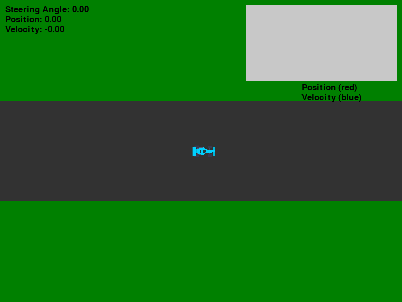

# Automated Vehicle System-Level Simulation and Testing Environment
###### Designing an Automated Vehicle System-Level Simulation and Testing Environment is a comprehensive endeavor that involves various specialized software, hardware, and integration methodologies.
-------------------------------------------------------------------------------------------------------------------------

#### Objective: Design an integrated, system-level simulated environment for a vehicle, emphasizing areas such as battery management, functional safety, vehicle mechatronics, and network management. The system will use automation tools for test scenario execution to ensure robustness, performance, and safety.
**Components:**
1. Vehicle Dynamics and Environment Simulator:
   - Using Python, create a simulation of vehicle behaviors including driving conditions, terrain, battery consumption, etc.
   - Integrate weather conditions, road conditions, and real-time challenges.
2. Battery Management System (BMS) Simulator:
    - Create a virtual Lithium-Ion and Lead-Acid BMS.
    - Simulate battery behaviors such as charge-discharge cycles, overcharge scenarios, temperature effects, etc.
3.  Body Control Simulator:
    - Design virtual actuators to represent vehicle mechatronics like falcon wings, power front doors, etc.
    - Apply scenarios where these mechatronics might malfunction or get stressed.
4.	Low Voltage Network Management:
     - Design a simulated low voltage network in a vehicle.
     - Incorporate scenarios where there are network congestions, failures, or security breaches.
5. Low Voltage Network Management:
   - Design a simulated low voltage network in a vehicle.
   - Incorporate scenarios where there are network congestions, failures, or security breaches.
6. Test Automation Infrastructure:
   - Incorporate Jenkins for Continuous Integration (CI) and testing automation.
   - Utilize Docker to containerize the simulation environment ensuring consistent and reproducible test scenarios.

7. Embedded Systems Integration:
   - Design a minimal firmware using C/C++ that would interact with your simulated environment.
   - This firmware can mock the behaviors of an actual vehicle's firmware, responding to different scenarios.
8. Dashboard and Analysis Tool:
   - A user-friendly interface that displays real-time data from the simulation.
   - Incorporate analysis tools that can root-cause issues, analyze battery performance, and check the performance of the vehicle mechatronics.
9. Scenario Execution:
    - Define test scenarios where multiple vehicle components are stressed simultaneously, such as challenging terrains, malfunctioning falcon wings, and a nearly depleted battery.
    - Use the automation infrastructure to run these scenarios and gather results.

###### Expected Outcomes:
	• Ability to simulate complex, real-world scenarios for a vehicle in a controlled environment.
	• Data on how different vehicle components behave under various conditions.
	• Insights into potential weak points or vulnerabilities in the vehicle's systems.
	• Demonstrable expertise in Python, system-level troubleshooting, automation tools, and firmware development.

#### Additional Considerations:
> Scalability: Future-proof the system architecture to accommodate additional components or functionalities.

> Real-time Simulation: Ensure simulations are real-time for effective testing and validation.

> Validation: Validate models consistently with real-world data sets to ensure reliability and accuracy.
