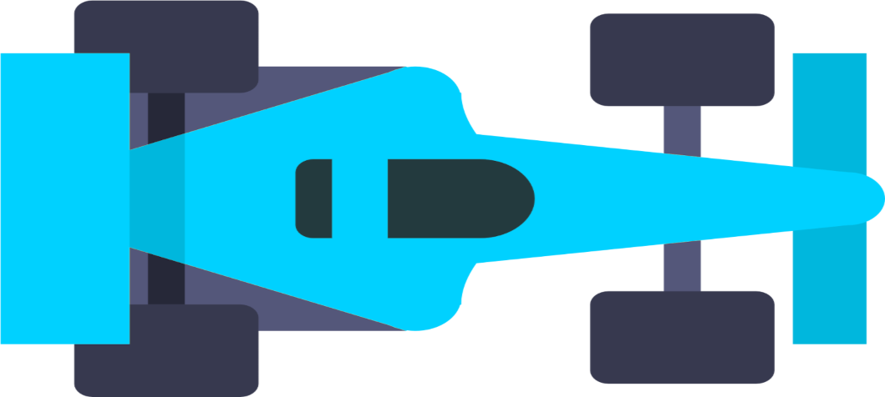

This component aims to emulate real-world driving conditions, terrains, battery consumption, weather conditions, & other parameters affecting vehicle performance.
	
	1> Basics of vehicle dynamics
	- Forces acting on a car while moving, turning, stopping
	- Basic kinematics & dynamics relating to vehicles
	
	2> Programming environment
	Python - numpy, matplotlib, pygame -help in simulation & visualization
	
	3> setting up virtual env, libraries
	python -m venv vehicle_sim_env
	source vehicle_sim_env/bin/activate  # On Windows use: vehicle_sim_env\Scripts\activate
	pip install numpy matplotlib pygame
	
	4> simple 2D model
	-representing vehicle as 
 
	Car Physics !https://onedrive.live.com/view.aspx?resid=BD9D5F610C37F9AA%216928&id=documents&wd=target%28New%20Section%203.one%7CF6FE6F81-38C8-4FDE-B4CD-6395348D0C1F%2FAutomated%20Vehicle%20System-Level%20Simulation%20and%20Testing%20Environment%7CC47C01EA-53F4-4F92-BE07-DC8DF83347D0%2F%29
onenote:https://d.docs.live.net/bd9d5f610c37f9aa/Documents/Utkarsh's%20Notebook/New%20Section%203.one#Automated%20Vehicle%20System-Level%20Simulation%20and%20Testing%20Environment&section-id={F6FE6F81-38C8-4FDE-B4CD-6395348D0C1F}&page-id={C47C01EA-53F4-4F92-BE07-DC8DF83347D0}&object-id={F51BC728-9232-40A1-B9D7-75AC4E1AD4EF}&78
	
	5> incorporate basic dynamics:
	- Motion: basic equatios of motion: used newton's law & kinematic equations to simulate acceleration, braking, coasting
	- Terrain: added different terrain types( e.g., flat, uphill, downhill). Each teraain had different friction coefficients affecting the vehicles acceleration or deceleration.
	
	6> Incorporate environment factors:
	- Weather conditions: rain,ice can decrease friction affecting braking distance.
	- Real time challenges: pothols, roadblocks which need sudden braking
	
	7> Visualization: using pygame, matplotlib: visualize vehicles motion in real time. Display speedometer, acceleration, terrain type, weather conditions
	
	8> Feedback loop with battery consumption.
	Faster accelerations drain the battery faster.
	Uphill terrain requires more power.
