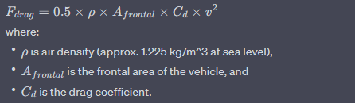
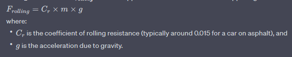
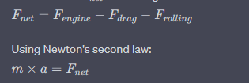
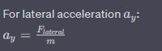
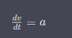
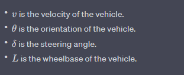

motion of vehicle:

1) longitudinal dynamics (basic forward-backward motion):
   - a) engine force: torque produced by the engine divided by the wheel
     

   - b). aerodynamic drag (Fdrag): Proportional to the square of the vehicle's speed
   
   - c) rolling resistance (Frolling): constant force opposing motion
   .

   - d) the net force Fnet in longitudinal direction
   
      
2) Lateral dynamics (side to side motion):
   a) Cornering Force: proportional to the tire slip angle

   

   assuming here there is no other significant lateral forces, so Flateral = Fcornering, we shall add slip angles, cornering stiffness

   
4) equations of motion

    
5) braking: implemented braking as a negative torque, which opposes the motion of vehicle e.x., F_brake
6) traction control: means prevent wheel spin during acceleration by detecting wheel spin and reducing engine torque or applying brake force to specific wheels.
7) Turning control.

   dx/dt = v * cos(θ + δ)
   dy/dt = v * sin(θ + δ)
   dθ/dt = v / L * sin(δ)

   
8)
